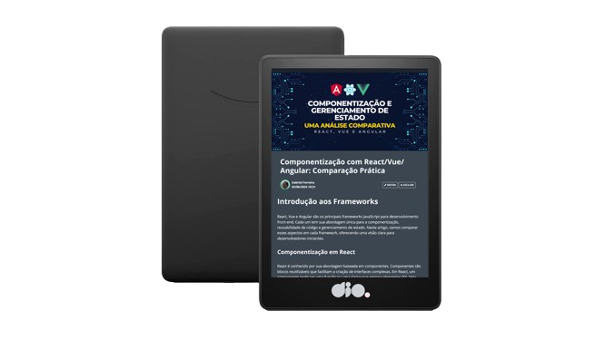

    

  
  

-------

  

# Projeto artigo técnico gerado por I.A.s

Projeto com o objetivo de gerar um artigo técnico com um layout rico, leitura agradável e com foco em promover sua autoridade técnica.

<a href="https://web.dio.me/articles/componentizacao-com-reactvueangular-comparacao-pratica?back=%2Farticles&open-modal=true&page=1&order=oldest" title="View PDF now"> 📕Clique aqui para ler o artigo</a>

## 💻 Tecnologias utilizadas no projeto

- [ChatGPT](https://chat.openai.com/) - Para título e conteúdo
- [Lexica.art](https://lexica.art/) - Para geração de imagens
- [PowerPoint](https://www.microsoft.com/en/microsoft-365/powerpoint) - Para formatação de banners e Layouts

## 📄 Prompts e ferramentas

ChatGPT：

|   Ação   | prompt                                                                                                                                                                                                                                                                         |
| :------: | ------------------------------------------------------------------------------------------------------------------------------------------------------------------------------------------------------------------------------------------------------------------------------ |
|  título  | Crie 10 variações de títulos para um artigo sobre o assunto Componentização com React/Vue/Angular que faz uma comparação entre os frameworks em termos de componentização, reusabilidade de código e gerenciamento de estado.                                                                                                                                                                                                 |
| conteúdo | Comporte-se como um produtor de conteúdos especialista em desenvolvimento full-stack. Escreva um artigo sobre Componentização com React/Vue/Angular: Faça uma comparação entre os frameworks React, Vue e Angular em termos de componentização, reusabilidade de código e gerenciamento de estado respeitando as regras abaixo {REGRAS} Cada parágrafo deve ter no máximo de 5 linhas Explique de uma maneira simples O público alvo do artigo são desenvolvedores iniciantes e estudantes Crie um subtítulo sugestivo para cada bloco Sempre traga exemplos de código em contextos reais Ao final do artigo adicione 3 hashtags relacionadas com o tema do artigo |

Lexica.art：

- No Lexica utilizamos o acervo público de imagens geradas por outras pessoas, os termos de pesquisa que utilizei durante a gravação do conteúdo foram:

• software development

## ✨ Features

- Conteúdo gerado via ChatGPT
- Imagens do acervo público geradas via Lexica.art

## 📚 Materiais

- prompts utilizados

## 🛠️ Instruções de execução

Utilize os prompts acima nas ferramentas sugeridas para gerar o material base e utilize uma ferramenta de edição de documentos como power point, libreoffice , indesign para diagramação, o passo a passo em vídeo pode ser conferido na plataforma da [DIO](https://dio.me).

## 👨‍💻 Autor

Gabriel Andrade  
[GitHub](https://github.com/4ndradeGabriel)  
[LinkedIn](https://www.linkedin.com/in/andradegabrielw)  

---

Desenvolvido por [Gabriel Andrade](https://github.com/4ndradeGabriel)
